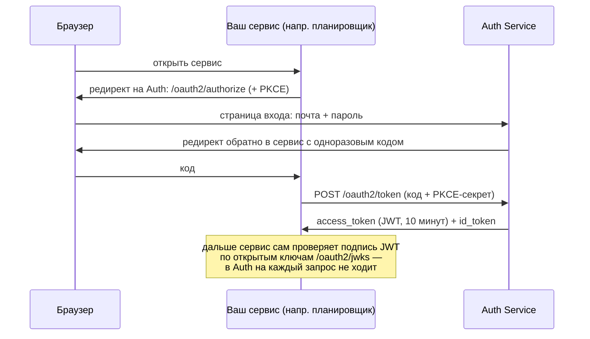

# Auth Service

Единый сервис входа (SSO, OpenID Connect) для цифровой экосистемы колледжа: планировщик, meet, соцсеть,
доска, заметки и другие сервисы входят **через него**, а не хранят пароли сами.

> **Статус:** в разработке, MVP. Регистрация, вход и выдача токенов работают. Для реальных пользователей
> пока не готов: нет сброса пароля, refresh-токенов, ролей и админки — см. [Дорожная карта](#дорожная-карта).

## Содержание

- [Как это работает](#как-это-работает)
- [Что уже умеет](#что-уже-умеет)
- [Стек](#стек)
- [Быстрый старт (локально)](#быстрый-старт-локально)
- [Настройки (переменные окружения)](#настройки-переменные-окружения)
- [Адреса сервиса](#адреса-сервиса)
- [Подключение своего сервиса](#подключение-своего-сервиса)
- [Деплой](#деплой)
- [Безопасность](#безопасность)
- [Разработка](#разработка)
- [Дорожная карта](#дорожная-карта)

---

## Как это работает



Главная идея: Auth выдаёт **короткоживущий JWT** (10 минут), подписанный ключом ES256. Любой сервис
проверяет подпись **сам**, скачав один раз открытые ключи с `/oauth2/jwks`. Поэтому Auth не становится
узким местом, а новый сервис подключается без изменений в коде Auth — только регистрацией клиента.

## Что уже умеет

| Возможность | Подробности |
|---|---|
| **Саморегистрация** | Любая почта. Аккаунт активен после перехода по ссылке из письма (ссылка одноразовая, живёт 24 ч). |
| **Вход** | Почта + пароль на странице `/login`. Пароли — Argon2id + «перец» (секрет вне БД). |
| **Защита от подбора** | Лимиты по IP (20 попыток входа в минуту, 5 регистраций в час). После 3 неверных паролей к почте — капча ALTCHA (без блокировки аккаунта). |
| **Выдача токенов (OIDC)** | Authorization Code + PKCE, access token и id token — JWT ES256, ключ постоянный. Discovery, JWKS, `/userinfo`. |
| **Документация API** | Swagger UI. |

## Стек

Java 25 · Spring Boot 4.1 · Spring Security 7 (включая Authorization Server) · PostgreSQL 18 · Redis 8 ·
Liquibase · Thymeleaf · Maven · Testcontainers.

---

## Быстрый старт (локально)

### Что нужно установить

- **JDK 25** (`openjdk-25-jdk`)
- **Docker** и **Docker Compose**; пользователь в группе `docker`
  (после добавления в группу — **перезагрузка**, в GNOME перелогиниться недостаточно)
- **OpenSSL** — для генерации секретов

### 1. Поднять базу, Redis и почтовую ловушку

```bash
docker compose up -d
```

| Сервис | Адрес | Зачем |
|---|---|---|
| PostgreSQL 18 | `localhost:5432`, база/пользователь `auth`/`auth`, пароль `auf67` | данные |
| Redis 8 | `localhost:6379` | счётчики попыток входа, лимиты, одноразовость капчи |
| Mailpit | SMTP `localhost:1025`, письма — **http://localhost:8025** | ловит все письма, наружу ничего не уходит |

> Если порт 5432 занят системным PostgreSQL — остановите его: `sudo systemctl disable --now postgresql`.

### 2. Создать файл `.env` с секретами

В корне проекта (файл в `.gitignore`, в репозиторий **не попадает**):

```bash
cat > .env <<EOF
PASSWORD_PEPPER=$(openssl rand -base64 48)
CAPTCHA_SECRET=$(openssl rand -base64 48)
JWT_SIGNING_KEY=$(openssl genpkey -algorithm EC -pkeyopt ec_paramgen_curve:P-256 | openssl pkcs8 -topk8 -nocrypt -outform DER | base64 -w0)
AUTH_DEV_CLIENT_ENABLED=true
EOF
chmod 600 .env
```

Приложение читает `.env` само при любом способе запуска (IntelliJ, `mvnw`).
**Не меняйте** `PASSWORD_PEPPER` после первых регистраций (все пароли перестанут подходить)
и `JWT_SIGNING_KEY` (все выданные токены станут недействительны).

### 3. Запустить

```bash
./mvnw spring-boot:run
```

Схема БД создаётся автоматически (Liquibase) при старте. Дальше:

1. **Зарегистрироваться:** http://localhost:8080/swagger-ui/index.html → «Регистрация» → `POST /api/v1/registrations` → Try it out.
2. **Открыть письмо:** http://localhost:8025 → ссылка «подтвердите почту» → кнопка.
3. **Войти:** http://localhost:8080/login.

### Тесты

```bash
./mvnw test
```

Нужен только запущенный Docker: тесты сами поднимают чистые PostgreSQL и Redis (Testcontainers),
`docker compose` и `.env` для них не нужны.

### Полезные команды

```bash
docker compose ps                                     # статус контейнеров
docker compose exec postgres psql -U auth -d auth     # консоль БД
docker compose down                                   # остановить (данные сохранятся)
docker compose down -v                                # ⚠️ остановить и СТЕРЕТЬ данные

# сбросить счётчики неудачных входов (капча) и лимиты по IP
docker compose exec redis redis-cli --scan --pattern 'login:failures:*' | xargs -r docker compose exec -T redis redis-cli DEL
docker compose exec redis redis-cli --scan --pattern 'rate:*'           | xargs -r docker compose exec -T redis redis-cli DEL
```

---

## Настройки (переменные окружения)

### Обязательные (без них приложение не стартует)

| Переменная | Что это | Как получить |
|---|---|---|
| `PASSWORD_PEPPER` | Секрет, подмешиваемый к паролям перед Argon2id. Не короче 32 символов. **Не менять.** | `openssl rand -base64 48` |
| `CAPTCHA_SECRET` | Подпись задачек капчи. Можно менять. | `openssl rand -base64 48` |
| `JWT_SIGNING_KEY` | Закрытый ключ подписи токенов: EC P-256, PKCS#8, base64 в одну строку. **Не менять** без плана ротации. | `openssl genpkey -algorithm EC -pkeyopt ec_paramgen_curve:P-256 \| openssl pkcs8 -topk8 -nocrypt -outform DER \| base64 -w0` |

> ⚠️ В OpenSSL 3 без шага `openssl pkcs8 -topk8` ключ получается в старом формате (начинается с `MHcC…`),
> Java его не прочитает. Правильный ключ начинается с `MIGH…`.

### С умолчаниями (для локальной разработки менять не нужно)

| Переменная | По умолчанию | Что это |
|---|---|---|
| `AUTH_PUBLIC_URL` | `http://localhost:8080` | Адрес, по которому Auth открывают снаружи. Из него — `iss` в токенах и ссылки в письмах. |
| `SPRING_DATASOURCE_URL` | `jdbc:postgresql://localhost:5432/auth` | Адрес БД |
| `SPRING_DATASOURCE_USERNAME` | `auth` | Пользователь БД |
| `DB_PASSWORD` | `auf67` (только для локальной БД!) | Пароль БД |
| `REDIS_HOST` / `REDIS_PORT` | `localhost` / `6379` | Redis. Пароль — `SPRING_DATA_REDIS_PASSWORD`. |
| `MAIL_HOST` / `MAIL_PORT` | `localhost` / `1025` (Mailpit) | SMTP-сервер |
| `MAIL_FROM` | `no-reply@auth.local` | Отправитель писем |
| `SESSION_COOKIE_SECURE` | `false` | Cookie сессии только по HTTPS. **На сервере — `true`.** |
| `AUTH_DEV_CLIENT_ENABLED` | `false` | Регистрировать клиента `planner-dev` для локальной разработки. **На сервере — не включать.** |
| `SPRINGDOC_API_DOCS_ENABLED`, `SPRINGDOC_SWAGGER_UI_ENABLED` | `true` | Swagger. Можно выключить на сервере. |

Любую настройку Spring Boot можно задать переменной окружения: точки → `_`, всё заглавными
(`spring.mail.username` → `SPRING_MAIL_USERNAME`).

---

## Адреса сервиса

### Для людей (браузер)

| Адрес | Что это |
|---|---|
| `/login` | Вход |
| `/` | «Вы вошли» + выход |
| `/verify-email?token=…` | Подтверждение почты (сюда ведёт ссылка из письма) |

### API

| Метод и адрес | Доступ | Что делает |
|---|---|---|
| `POST /api/v1/registrations` | открыт | Регистрация. Всегда `202` — и для новой, и для занятой почты (чтобы нельзя было узнать, кто зарегистрирован). |
| `POST /api/v1/email-verifications` | открыт | Подтверждение почты по токену из письма: `204` / `400`. |

Подробно, с примерами и кнопкой «Try it out» — **Swagger UI: `/swagger-ui/index.html`**.
Ошибки — в стандартном формате RFC 9457 (`application/problem+json`).

### OpenID Connect (для сервисов)

| Адрес | Что это |
|---|---|
| `/.well-known/openid-configuration` | «Визитка» сервера: все адреса ниже. Большинству библиотек достаточно только её. |
| `/oauth2/authorize` | Начало входа (браузер пользователя) |
| `/oauth2/token` | Обмен кода на токены (сервер-сервер) |
| `/oauth2/jwks` | Открытые ключи для проверки подписи токенов |
| `/userinfo` | Данные пользователя по access token |

---

## Подключение своего сервиса

### Протокол

**OAuth 2.1 / OpenID Connect, Authorization Code + PKCE (S256, обязателен).**
Подойдёт любая стандартная библиотека OIDC-клиента: Spring Security OAuth2 Client, Authlib (Python),
`openid-client` (Node.js) и т.д. Настраивается одной строкой — адресом issuer.

### Клиент для локальной разработки

При `AUTH_DEV_CLIENT_ENABLED=true` зарегистрирован клиент:

| Параметр | Значение |
|---|---|
| issuer | `http://localhost:8080` |
| `client_id` | `planner-dev` |
| секрет | нет (публичный клиент, защищён PKCE) |
| `redirect_uri` | `http://127.0.0.1:8090/login/oauth2/code/auth` — **ровно этот**, и именно `127.0.0.1`, не `localhost` |
| scopes | `openid`, `profile` |
| экран согласия | нет (свой сервис) |

> Регистрация клиентов для сервера (со своими `client_id` и адресами возврата) пока делается вручную
> разработчиками Auth — появится в админке (задача 9). Нужен клиент — напишите в команду Auth.

### Как проверять токен в своём сервисе

Сервис получает `Authorization: Bearer <access_token>` и **сам** проверяет:

1. **Подпись** — алгоритм `ES256`, ключ из `/oauth2/jwks` по `kid` из заголовка токена.
   Ключи кешировать; если пришёл незнакомый `kid` — перечитать JWKS.
2. **`iss`** — ровно адрес Auth (например, `http://localhost:8080`).
3. **`aud`** — ваш `client_id` (токен для другого сервиса не принимать).
4. **`exp`** — не истёк (access token живёт **10 минут**).

Готовые библиотеки делают всё это сами, если указать issuer и audience. Писать проверку подписи вручную не нужно.

### Что лежит в access token

| Поле | Значение |
|---|---|
| `sub` | **id пользователя (UUID)** — постоянный, не меняется никогда. Свои данные о пользователе храните по нему. |
| `iss` | адрес Auth |
| `aud` | `client_id` сервиса |
| `scope` | выданные права, например `["openid", "profile"]` |
| `iat`, `exp` | когда выдан и когда истекает |

Почта, имя и роли в токене **пока не передаются** (шаг 3.4 и задача про роли).
В id token дополнительно есть `auth_time` — когда пользователь вводил пароль.

### Пример: вход вручную через curl

Полезно, чтобы понять протокол или проверить Auth без своего сервиса.

```bash
# 1. PKCE: секрет (verifier) и его хеш (challenge)
VERIFIER="verifier-$(openssl rand -hex 24)"
CHALLENGE=$(printf %s "$VERIFIER" | openssl dgst -sha256 -binary | openssl base64 -A | tr '+/' '-_' | tr -d '=')

# 2. Открыть в браузере (войти, после входа браузер уйдёт на 127.0.0.1:8090 — страница не откроется,
#    это нормально: скопируйте из адресной строки значение параметра code)
echo "http://localhost:8080/oauth2/authorize?response_type=code&client_id=planner-dev&scope=openid%20profile&redirect_uri=http://127.0.0.1:8090/login/oauth2/code/auth&state=xyz&code_challenge=$CHALLENGE&code_challenge_method=S256"

# 3. Обменять код на токены (код одноразовый и живёт несколько минут)
curl -s -X POST http://localhost:8080/oauth2/token \
  -d grant_type=authorization_code \
  -d client_id=planner-dev \
  -d redirect_uri=http://127.0.0.1:8090/login/oauth2/code/auth \
  --data-urlencode "code=ВСТАВЬТЕ_КОД" \
  --data-urlencode "code_verifier=$VERIFIER"

# 4. Кто я
curl -s -H "Authorization: Bearer ACCESS_TOKEN" http://localhost:8080/userinfo
```

---

## Деплой

### Сборка

```bash
./mvnw -DskipTests package
java -jar target/authCollage-0.0.1-SNAPSHOT.jar
```

Нужен JDK/JRE 25. Миграции БД применяются автоматически при старте (Liquibase).

### Что нужно на сервере

- **PostgreSQL 18** (нужна функция `uuidv7()`, её нет в более старых версиях).
- **Redis** — **обязателен**: без него вход и регистрация не работают (осознанно: «лучше закрыто, чем без защиты»). Мониторить наравне с БД.
- **SMTP-сервер** для писем (адрес, логин/пароль через `SPRING_MAIL_*`; для STARTTLS — `SPRING_MAIL_PROPERTIES_MAIL_SMTP_STARTTLS_ENABLE=true`).
- **HTTPS** перед приложением (обратный прокси).

### Чек-лист перед запуском

- [ ] Сгенерированы **новые** `PASSWORD_PEPPER`, `CAPTCHA_SECRET`, `JWT_SIGNING_KEY` (не локальные!), хранятся в менеджере секретов, не в коде.
- [ ] `AUTH_PUBLIC_URL` = настоящий адрес по HTTPS (от него зависят `iss` токенов и ссылки в письмах).
- [ ] `SESSION_COOKIE_SECURE=true`.
- [ ] `AUTH_DEV_CLIENT_ENABLED` **не** включён.
- [ ] Свой пароль БД (`DB_PASSWORD`), адрес БД (`SPRING_DATASOURCE_URL`).
- [ ] Решено, нужен ли Swagger снаружи (`SPRINGDOC_*_ENABLED=false`).
- [ ] **Прокси и IP:** лимиты считаются по адресу клиента. За прокси приложение увидит адрес прокси —
      все пользователи попадут в один лимит. Включить `SERVER_FORWARD_HEADERS_STRATEGY=native` и доверять
      `X-Forwarded-For` **только от своего прокси** (иначе лимит обходится подделкой заголовка).

### Ограничения масштабирования (пока)

- **Одна копия приложения** или «липкие» сессии на балансировщике: сессия входа пока хранится в памяти
  приложения. Для нескольких копий нужен Spring Session + Redis (в планах).
- Всё остальное уже общее для всех копий: БД, Redis, ключ подписи, секреты.

---

## Безопасность

- Своей криптографии нет: Argon2id и Authorization Server — Spring Security, HMAC/SHA-256 — JDK,
  капча — ALTCHA, лимиты — Bucket4j.
- Пароли: Argon2id (19 МиБ, 2 прохода) + перец вне БД. Токены из писем хранятся только как SHA-256.
- Нельзя узнать, зарегистрирована ли почта: одинаковые ответы при регистрации и входе, одинаковое время ответа,
  капча появляется одинаково для существующих и выдуманных адресов.
- CSRF-защита всех форм, выход только POST, `X-Frame-Options: DENY`, cookie `HttpOnly` + `SameSite=Lax`.
- Известные открытые вопросы (разбираются в ревью задачи 3): коды и токены в таблице `oauth2_authorization`
  хранятся открытым текстом; таблица не очищается от истёкших записей.

Нашли уязвимость — сообщите команде Auth напрямую, не в общий чат.

---

## Разработка

### Структура кода

```
src/main/java/com/example/planner/
├── user/          пользователь, почта, хеширование паролей
├── registration/  регистрация и подтверждение почты (API, страница, письмо)
├── onetimetoken/  одноразовые токены для ссылок из писем
├── login/         вход: поиск пользователя, страницы, капча при входе, счётчики неудач
├── captcha/       ALTCHA: выдача задачек и проверка решений
├── ratelimit/     лимиты запросов по IP
├── authserver/    OAuth 2.1 / OIDC: цепочка фильтров, ключ подписи, клиенты и авторизации в БД
└── SecurityConfiguration, OpenApiConfiguration, ClockConfiguration
src/main/resources/
├── db/changelog/  миграции Liquibase (SQL)
├── templates/     страницы (Thymeleaf)
└── static/        стили и скрипт виджета капчи
```

### Правила

- **Схемой БД управляет только Liquibase**, миграции на SQL. Применённую миграцию не правят — только новая.
- Время — `timestamptz` в БД и `Instant.now(clock)` в коде (бин `Clock`, чтобы подменять время в тестах).
- Каждая новая HTTP-ручка **закрыта по умолчанию**; открыть — явно в `SecurityConfiguration`.
  Каждую ручку описывать в Swagger (`@Operation`, `@ApiResponse`).
- Ветки `feature/...`, коммиты — Conventional Commits по-русски, одна задача = один PR.
- Подробные соглашения, решения и «подводные камни» — в [`CLAUDE.md`](CLAUDE.md).
  Полная архитектура — в [`docs/`](docs/).

---

## Дорожная карта

**Сделано:** каркас · регистрация с подтверждением почты · вход · защита от подбора (лимиты + капча) ·
выдача токенов OIDC с постоянным ключом и хранением в БД.

**Ближайшее (чтобы планировщик мог подключиться):**
почта и имя в токене · ревью безопасности выдачи токенов · документ-контракт для сервисов.

**Дальше (чтобы пускать реальных пользователей):**
сброс пароля · refresh-токены с ротацией · журнал событий безопасности · сессии в Redis ·
Gateway/BFF · тесты безопасности.

**Полный MVP:** роли · админка (в т.ч. регистрация клиентов) · личный кабинет `/me` ·
двухфакторный вход (TOTP) · приглашения по списку.
