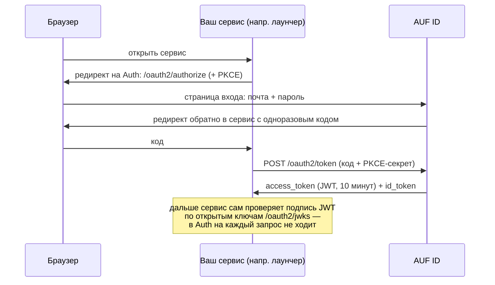

# AUF ID

Единый сервис входа (SSO, OpenID Connect) для цифровой экосистемы колледжа: планировщик, meet, соцсеть,
доска, заметки и другие сервисы входят **через него**, а не хранят пароли сами.

> **Статус:** в разработке, MVP. Выдача учёток с согласием на ПДн, вход, роли, админка,
> выдача токенов, продление входа refresh-токеном с выявлением кражи работают. Для реальных
> пользователей пока не готов: нет HTTPS и домена, проверенного восстановления из бэкапа,
> журнала действий и способа завести первую учётку на пустой базе — см.
> [Дорожная карта](#дорожная-карта).
>
> Первые клиенты — **лаунчер Minecraft** и **планировщик**, делаются одновременно.

## Содержание

- [Как это работает](#как-это-работает)
- [Что уже умеет](#что-уже-умеет)
- [Стек](#стек)
- [Быстрый старт (локально)](#быстрый-старт-локально)
- [Настройки (переменные окружения)](#настройки-переменные-окружения)
- [Адреса сервиса](#адреса-сервиса)
- [Подключение своего сервиса](#подключение-своего-сервиса)
- [Деплой](#деплой)
- [Безопасность](#безопасность)
- [Разработка](#разработка)
- [Дорожная карта](#дорожная-карта)

---

## Как это работает



Главная идея: Auth выдаёт **короткоживущий JWT** (10 минут), подписанный ключом ES256. Любой сервис
проверяет подпись **сам**, скачав один раз открытые ключи с `/oauth2/jwks`. Поэтому Auth не становится
узким местом, а новый сервис подключается без изменений в коде Auth — только регистрацией клиента.

## Что уже умеет

| Возможность | Подробности |
|---|---|
| **Выдача учёток** | Аккаунты заводит администратор, только с почтой колледжа (`@sinhub.ru`). Человек получает одноразовую ссылку, задаёт по ней пароль (от 12 символов, не из списка утёкших) и даёт согласие на обработку ПДн. Писем сервис не отправляет. |
| **Роли** | `ADMIN`, `CURATOR`, `STUDENT` — едут в токене, по ним сервисы решают, пускать ли. |
| **Вход** | Почта + пароль на странице `/login`. Пароли — Argon2id + «перец» (секрет вне БД). |
| **Защита от подбора** | После 3 неверных паролей к почте — капча ALTCHA (без блокировки аккаунта). Плюс лимит по IP: 300 попыток входа в минуту (настраивается; с запасом под общий NAT колледжа). |
| **Выдача токенов (OIDC)** | Authorization Code + PKCE, access token и id token — JWT ES256, ключ постоянный. Discovery, JWKS, `/userinfo`. |
| **Админка** | `/api/v1/admin/users/**` — список и поиск, завести учётку, исправить ФИО и почту, перевыдать ссылку, заблокировать, выдать роль. `/api/v1/admin/clients/**` — подключить сервис к SSO. Только для `ADMIN`, с защитой от CSRF. |
| **Блокировка** | Действует сразу: новые токены не выдаются, открытая сессия закрывается на следующем запросе, снятая роль перестаёт действовать без повторного входа. Уже выданный access token доживает до 10 минут. |
| **Продление входа** | Refresh-токен на 30 дней от последнего обновления, с ротацией. Повторно предъявленный старый токен — признак кражи: обрывается вся цепочка. Выдаётся только настольным приложениям (`NATIVE`): в браузере его украдёт XSS. |
| **Документация API** | Swagger UI. |

**Чего ещё нет:** журнала действий, сброса пароля (новую ссылку выдаёт администратор), `/me`, TOTP,
импорта учёток списком. Личных почт и рассылок в AUF ID не будет — это отдельные сервисы экосистемы.

## Стек

Java 25 · Spring Boot 4.1 · Spring Security 7 (включая Authorization Server) · PostgreSQL 18 · Redis 8 ·
Liquibase · Thymeleaf · Maven · Testcontainers.

---

## Быстрый старт (локально)

### Что нужно установить

- **JDK 25** (`openjdk-25-jdk`)
- **Docker** и **Docker Compose**; пользователь в группе `docker`
  (после добавления в группу — **перезагрузка**, в GNOME перелогиниться недостаточно)
- **OpenSSL** — для генерации секретов

> Файл `.env` нужен **до** `docker compose up`: параметры базы читает и compose, и приложение.

### 1. Поднять базу и Redis

```bash
docker compose up -d
```

| Сервис | Адрес | Зачем |
|---|---|---|
| PostgreSQL 18 | `localhost:5432`, база/пользователь `auth`/`auth`, пароль `auf67` | данные |
| Redis 8 | `localhost:6379` | счётчики попыток входа, лимиты, одноразовость капчи, реестр погашенных refresh-токенов |

> Если порт 5432 занят системным PostgreSQL — остановите его: `sudo systemctl disable --now postgresql`.

### 2. Создать файл `.env` с секретами

В корне проекта (файл в `.gitignore`, в репозиторий **не попадает**):

```bash
cat > .env <<EOF
PASSWORD_PEPPER=$(openssl rand -base64 48)
CAPTCHA_SECRET=$(openssl rand -base64 48)
JWT_SIGNING_KEY=$(openssl genpkey -algorithm EC -pkeyopt ec_paramgen_curve:P-256 | openssl pkcs8 -topk8 -nocrypt -outform DER | base64 -w0)
AUTH_DEV_CLIENT_ENABLED=true
DB_NAME=aufid
DB_USER=auth
DB_PASSWORD=$(openssl rand -base64 24 | tr -d '/+=' | head -c 24)
EOF
chmod 600 .env
```

> Входят только почты домена `sinhub.ru`. Если в локальной базе уже есть учётки с другими
> адресами (например, `@mail.ru`, заведённые до 2026-10-10), добавьте в `.env` их домен:
> `AUTH_ALLOWED_EMAIL_DOMAINS=sinhub.ru,mail.ru`.

Приложение читает `.env` само при любом способе запуска (IntelliJ, `mvnw`).
**Не меняйте** `PASSWORD_PEPPER` после первых регистраций (все пароли перестанут подходить)
и `JWT_SIGNING_KEY` (все выданные токены станут недействительны).

### 3. Запустить

```bash
./mvnw spring-boot:run
```

Схема БД создаётся автоматически (Liquibase) при старте. Дальше:

1. **Завести учётку:** Swagger → «Админка: пользователи» → `POST /api/v1/admin/users`.
   Нужен вход администратором — см. «Первый администратор».
2. **Открыть ссылку активации** из ответа, задать пароль (от 12 символов) и дать согласие на
   обработку ПДн.
3. **Войти:** http://localhost:8080/login.

### Тесты

```bash
./mvnw test
```

Нужен только запущенный Docker: тесты сами поднимают чистые PostgreSQL и Redis (Testcontainers),
`docker compose` и `.env` для них не нужны.

### Полезные команды

```bash
docker compose ps                                     # статус контейнеров
docker compose exec postgres psql -U auth -d auth     # консоль БД
docker compose down                                   # остановить (данные сохранятся)
docker compose down -v                                # ⚠️ остановить и СТЕРЕТЬ данные

# сбросить счётчики неудачных входов (капча) и лимиты по IP
docker compose exec redis redis-cli --scan --pattern 'login:failures:*' | xargs -r docker compose exec -T redis redis-cli DEL
docker compose exec redis redis-cli --scan --pattern 'rate:*'           | xargs -r docker compose exec -T redis redis-cli DEL
```

---

## Настройки (переменные окружения)

### Обязательные (без них приложение не стартует)

| Переменная | Что это | Как получить |
|---|---|---|
| `PASSWORD_PEPPER` | Секрет, подмешиваемый к паролям перед Argon2id. Не короче 32 символов. **Не менять.** | `openssl rand -base64 48` |
| `CAPTCHA_SECRET` | Подпись задачек капчи. Можно менять. | `openssl rand -base64 48` |
| `JWT_SIGNING_KEY` | Закрытый ключ подписи токенов: EC P-256, PKCS#8, base64 в одну строку. **Не менять** без плана ротации. | `openssl genpkey -algorithm EC -pkeyopt ec_paramgen_curve:P-256 \| openssl pkcs8 -topk8 -nocrypt -outform DER \| base64 -w0` |
| `DB_NAME` / `DB_USER` | Имя базы и пользователь. | `auth` / `auth` для локальной разработки |
| `DB_PASSWORD` | Пароль БД. Умолчания нет намеренно: репозиторий публичный. | `openssl rand -base64 24 \| tr -d '/+=' \| head -c 24` |

> ⚠️ В OpenSSL 3 без шага `openssl pkcs8 -topk8` ключ получается в старом формате (начинается с `MHcC…`),
> Java его не прочитает. Правильный ключ начинается с `MIGH…`.

### С умолчаниями (для локальной разработки менять не нужно)

| Переменная | По умолчанию | Что это |
|---|---|---|
| `AUTH_PUBLIC_URL` | `http://localhost:8080` | Адрес, по которому Auth открывают снаружи. Из него — `iss` в токенах и ссылки активации. |
| `DB_HOST` / `DB_PORT` | `localhost` / `5432` | Где искать базу |
| `REDIS_HOST` / `REDIS_PORT` | `localhost` / `6379` | Redis. Пароль — `SPRING_DATA_REDIS_PASSWORD`. |
| `SESSION_COOKIE_SECURE` | `false` | Cookie сессии только по HTTPS. **На сервере — `true`.** |
| `FORWARD_HEADERS_STRATEGY` | `none` | `native` — брать адрес клиента из `X-Forwarded-For`. **За прокси обязательно**, иначе все пользователи попадут в один лимит. |
| `TRUSTED_PROXIES` | `127.0.0.1/32` | От кого принимать `X-Forwarded-For`, список сетей (CIDR). **На сервере — адрес своего прокси**, например `10.0.0.5/32`. IPv6-loopback (`::1`) в умолчание не входит: если прокси на той же машине ходит по IPv6, допишите его. |
| `BOOTSTRAP_ADMIN_EMAILS` | пусто | Почты первых администраторов через запятую. Роль `ADMIN` выдаётся при входе — только пока в системе нет ни одного действующего администратора. Пусто — механизм отключён. |
| `AUTH_ALLOWED_EMAIL_DOMAINS` | `sinhub.ru` | Почты каких доменов допускаются (через запятую, совпадение точное, поддомены — отдельно). Пустой список — ошибка при старте. |
| `AUTH_LOGIN_RATE_LIMIT` | `300` | Попыток входа в минуту с одного IP. Большое с запасом: колледж, скорее всего, за общим NAT. От подбора защищает капча. |
| `AUTH_TOKEN_RATE_LIMIT` | `600` | Запросов к `POST /oauth2/token` в минуту с одного IP. |
| `AUTH_CSRF_COOKIE_NAME` | `XSRF-TOKEN` | Имя cookie с токеном CSRF. **На сервере — `__Host-XSRF-TOKEN`**: такую cookie не подбросит соседний поддомен. С `SESSION_COOKIE_SECURE=true` и обычным именем приложение не стартует. |
| `AUTH_CORS_ALLOWED_ORIGINS` | пусто | Адреса браузерных приложений (через запятую, `*` запрещён), которым можно обменивать код на токен из JavaScript. Пусто — CORS выключен. |
| `AUTH_DEV_CLIENT_ENABLED` | `false` | Регистрировать клиентов `launcher-dev` и `planner-dev` для локальной разработки. **На сервере — не включать.** |
| `SPRINGDOC_API_DOCS_ENABLED`, `SPRINGDOC_SWAGGER_UI_ENABLED` | `true` | Swagger. Можно выключить на сервере. |

Любую настройку Spring Boot можно задать переменной окружения: точки → `_`, всё заглавными
(`spring.data.redis.host` → `SPRING_DATA_REDIS_HOST`).

---

## Админка (API)

Только для роли `ADMIN`. Подробности и «попробовать» — в Swagger.

| Метод и адрес | Что делает |
|---|---|
| `GET /api/v1/admin/users?query=&status=&page=&size=` | список: поиск по ФИО или почте, фильтр по статусу, страницами (до 100) |
| `POST /api/v1/admin/users` | завести учётку (почта колледжа), вернуть ссылку активации |
| `GET /api/v1/admin/users/{id}` | посмотреть учётку |
| `PATCH /api/v1/admin/users/{id}` | исправить ФИО и/или почту (новая почта — в домене колледжа и не занята) |
| `POST /api/v1/admin/users/{id}/activation-link` | выдать новую ссылку, прежние перестают работать |
| `POST /api/v1/admin/users/{id}/block` | закрыть доступ сразу: погасить ссылки, отозвать выданное, закрыть открытую сессию |
| `POST /api/v1/admin/users/{id}/unblock` | снять блокировку |
| `PUT /api/v1/admin/users/{id}/roles/{role}` | выдать роль |
| `DELETE /api/v1/admin/users/{id}/roles/{role}` | снять роль |

Ссылку активации видно **только в ответе на создание**: в базе хранится лишь хеш токена.
Потерялась — выдайте новую.

Снять роль `ADMIN` у последнего действующего администратора нельзя: иначе в админку
не попасть никому, и восстановить доступ можно будет только правкой базы.

Запрос к `/api/**` без входа получает `401`, а не редирект на страницу логина.

**Изменяющие запросы требуют токен CSRF**: админка входит по cookie сессии, и без него любая
страница на соседнем поддомене колледжа могла бы отправить форму от имени вошедшего админа.
Токен приходит в cookie `XSRF-TOKEN` (на сервере — `__Host-XSRF-TOKEN`) на любом ответе; вернуть
его нужно заголовком `X-XSRF-TOKEN`. Swagger UI делает это сам. Из `curl`:

```bash
# Сессия и токен CSRF — из любого ответа (например, после входа через форму)
curl -s -c jar -b jar http://localhost:8080/api/v1/admin/users > /dev/null
XSRF=$(awk '$6=="XSRF-TOKEN"{print $7}' jar)
curl -s -b jar -H "X-XSRF-TOKEN: $XSRF" -X POST http://localhost:8080/api/v1/admin/users/ID/block
```

## Подключение нового сервиса

Регистрируется через админку, правок кода Auth не требует.

```bash
# jar и XSRF — как в разделе «Админка (API)» выше
curl -s -b jar -H "X-XSRF-TOKEN: $XSRF" -X POST http://localhost:8080/api/v1/admin/clients \
  -H 'Content-Type: application/json' -d '{
    "clientId": "planner",
    "name": "Планировщик",
    "kind": "BROWSER",
    "redirectUris": ["https://planner.sinhub.ru/callback"]
  }'
```

Вид клиента задаёт сразу всё — способ аутентификации, разрешённые потоки, обязательность PKCE:

| Вид | Для чего | Секрет | Refresh-токен | Адреса возврата |
|---|---|---|---|---|
| `BROWSER` | приложение во вкладке браузера (SPA) | нет, только PKCE | нет, продление через `prompt=none` | обязательны |
| `NATIVE` | настольное или мобильное приложение (лаунчер) | есть (спрятать нельзя, защищает PKCE — см. `ClientKind.NATIVE`) | да, 30 дней с ротацией | обязательны |
| `CONFIDENTIAL` | серверное приложение со своими страницами | есть | нет | обязательны |
| `SERVICE` | сервис к сервису (`client_credentials`) | есть | нет | **запрещены** |

Так нельзя собрать нерабочую комбинацию: браузерный клиент с секретом (в браузере его не
спрятать), сервисный с адресом возврата (возвращаться некуда) или код авторизации без PKCE.

**Секрет виден только в ответе на регистрацию.** В базе хранится хеш. Потерялся — выдайте
новый через `POST /api/v1/admin/clients/{clientId}/secret`, прежний перестанет работать.

Остальные ручки: `GET /clients`, `GET /clients/{id}`, `DELETE /clients/{id}` (снятие
регистрации уносит и выданные клиенту авторизации).


## Первый администратор

Роли выдаются через админку, но открыть её некому, пока нет ни одного администратора.
Поэтому первых называют в настройках:

```bash
# .env
BOOTSTRAP_ADMIN_EMAILS=director@sinhub.ru,boss@sinhub.ru
```

Роль `ADMIN` присваивается при **входе** такого пользователя — на старте приложения
учётки может ещё не быть, и настройку пришлось бы применять перезапуском.

Срабатывает **только пока в системе нет ни одного действующего администратора**: первый
вошедший из списка становится админом, остальных он назначит сам. Поэтому снятая через админку
роль не возвращается при следующем входе. Новая роль действует сразу, без повторного входа.

Кривой адрес или адрес не из домена колледжа в списке уронит приложение при старте — это
нарочно, иначе он тихо превратился бы в «администратора, который никогда не совпадёт».

> ⚠️ **Открытый вопрос: первая учётка на пустой базе.** Механизм выдаёт роль, но учётку не
> создаёт, а создавать учётки может только администратор. На свежей базе (первый деплой, новая
> машина разработчика) завести первую учётку пока нечем. Решить до деплоя — см. дорожную карту.

## Адреса сервиса

### Для людей (браузер)

| Адрес | Что это |
|---|---|
| `/login` | Вход |
| `/` | «Вы вошли» + выход |
| `/activate?token=…` | Установка пароля и согласие на обработку ПДн (сюда ведёт ссылка от администратора) |
| `/consent/personal-data` | Текст согласия на обработку ПДн (пока черновик) |

### API

| Метод и адрес | Доступ | Что делает |
|---|---|---|
| `/api/v1/admin/**` | только `ADMIN` | Админка: учётки, роли, клиенты. Без входа — `401`. |

Подробно, с примерами и кнопкой «Try it out» — **Swagger UI: `/swagger-ui/index.html`**.
Ошибки — в стандартном формате RFC 9457 (`application/problem+json`).

### OpenID Connect (для сервисов)

| Адрес | Что это |
|---|---|
| `/.well-known/openid-configuration` | «Визитка» сервера: все адреса ниже. Большинству библиотек достаточно только её. |
| `/oauth2/authorize` | Начало входа (браузер пользователя) |
| `/oauth2/token` | Обмен кода на токены (сервер-сервер) |
| `/oauth2/jwks` | Открытые ключи для проверки подписи токенов |
| `/userinfo` | Данные пользователя по access token |

---

## Подключение своего сервиса

> **Разработчику другого сервиса — отдельная страница: [Как подключить свой сервис к AUF ID](docs/service-integration.md).**
> Там всё то же самое, но собрано под одну задачу и без внутренних деталей AUF ID — её можно
> давать ссылкой. Ниже — то же для тех, кто уже в этом README.

### Протокол

**OAuth 2.1 / OpenID Connect, Authorization Code + PKCE (S256, обязателен).**
Подойдёт любая стандартная библиотека OIDC-клиента: Spring Security OAuth2 Client, Authlib (Python),
`openid-client` (Node.js) и т.д. Настраивается одной строкой — адресом issuer.

### Клиенты для локальной разработки

При `AUTH_DEV_CLIENT_ENABLED=true` регистрируются **два** клиента — по одному на каждый из
сервисов, которые делаются сейчас. Они устроены по-разному, поэтому и клиента два: разрабатывать
планировщик против настроек лаунчера значит обнаружить расхождение уже на сервере.

| Параметр | Лаунчер | Планировщик |
|---|---|---|
| `client_id` | `launcher-dev` | `planner-dev` |
| вид | `NATIVE` (настольное приложение) | `BROWSER` (приложение во вкладке) |
| секрет | `launcher-dev-secret` | нет (в JavaScript прятать негде) |
| `redirect_uri` | `http://127.0.0.1:8090/login/oauth2/code/auth` | `http://127.0.0.1:5173/auth/callback` |
| refresh-токен | да, 30 дней с ротацией | нет, продление через `prompt=none` |

Общее у обоих: issuer `http://localhost:8080`, scopes `openid`, `profile`, `email`, PKCE
обязателен, экрана согласия нет (свои сервисы). В `redirect_uri` **путь сверяется ровно**, а вот
порт для адресов `127.0.0.1` может быть любым (RFC 8252) — dev-сервер фронтенда вправе слушать
5173, 3000 или что угодно. Именно `127.0.0.1`, не `localhost`.

> Секрет лаунчера лежит в коде открыто намеренно: это клиент только для разработки, на сервере
> `AUTH_DEV_CLIENT_ENABLED` не включают, а настоящие клиенты получают секреты через админку.

> **Python-микросервис планировщика регистрировать не нужно.** Клиент — тот, кто ведёт человека
> на страницу входа, то есть браузерное приложение. Микросервис за ним только проверяет готовый
> токен, а значит он **сервер ресурсов**: достаточно прочитать `jwks_uri` из discovery и сверять
> подпись, `iss`, `aud` и `exp`. Секрета у него нет.

#### Продление входа в браузерном приложении

Refresh-токена у вида `BROWSER` нет — в браузере его украл бы XSS. Вместо него «молчаливое
продление»: вкладка заходит на `/oauth2/authorize` с `prompt=none`. Вошедшему сервер сразу
вернёт новый код, не показывая форму; не вошедшему — ошибку `login_required`, по которой
приложение отправит человека входить.

```
http://localhost:8080/oauth2/authorize?response_type=code&client_id=planner-dev
  &scope=openid%20profile%20email&redirect_uri=http://127.0.0.1:5173/auth/callback
  &state=xyz&code_challenge=...&code_challenge_method=S256&prompt=none
```

Два ограничения, о которых лучше знать до того, как писать код:

- **Скрытым iframe продлевать нельзя.** `/oauth2/authorize` отвечает `X-Frame-Options: DENY`
  (защита от clickjacking). Приём «невидимый iframe для silent renew» из статей про SPA здесь
  не заработает — нужен переход страницы или всплывающее окно.
- **Нужен CORS.** Код на токен вкладка меняет из JavaScript, поэтому адрес приложения должен быть
  в `AUTH_CORS_ALLOWED_ORIGINS` (через запятую, `*` запрещён, пусто по умолчанию). Для dev-сервера
  это, например, `AUTH_CORS_ALLOWED_ORIGINS=http://127.0.0.1:5173`.

> Клиент для сервера (со своим `client_id` и адресами возврата) регистрируется через админку:
> `POST /api/v1/admin/clients`, нужна роль `ADMIN`. Нужен клиент — напишите в команду Auth.

### Как проверять токен в своём сервисе

Это касается **любого микросервиса**, который принимает запросы от вошедшего человека. В терминах
OAuth такой сервис — не клиент, а **сервер ресурсов**: он никого не пускает внутрь и в AUF ID его
регистрировать не нужно. Клиент — тот, кто ведёт человека на страницу входа (браузерное приложение
или лаунчер).

Сервис получает `Authorization: Bearer <access_token>` и **сам** проверяет:

1. **Подпись** — алгоритм `ES256`, ключ из `/oauth2/jwks` по `kid` из заголовка токена.
   Ключи кешировать; если пришёл незнакомый `kid` — перечитать JWKS.
2. **`iss`** — ровно адрес Auth (например, `http://localhost:8080`).
3. **`aud`** — см. врезку ниже, это самое неочевидное место.
4. **`exp`** — не истёк (access token живёт **10 минут**).

Готовые библиотеки делают всё это сами, если указать issuer и audience. Писать проверку подписи
вручную не нужно — и не стоит.

> **Про `aud` для микросервисов.** В `aud` лежит `client_id` **приложения, которое запросило
> токен**, а не имя вашего микросервиса. Микросервис за планировщиком сверяет `aud` с
> `planner-dev` — тем клиентом, через который человек вошёл.
>
> Отсюда следствие: если за одним приложением стоит несколько микросервисов, **один и тот же
> токен принимают все они**. Токен планировщика соцсеть не примет (у неё другой `aud`), но внутри
> планировщика разделения нет. Нужно развести права между своими микросервисами — делайте это
> по `scope`: при регистрации клиента можно задать свои права вида `planner.read`,
> `notes.write`, и каждый сервис проверяет нужный ему.

> **Ротации ключа подписи пока нет.** В JWKS один ключ. Кешировать его можно и нужно, но
> «мягкой» смены ключа не будет: если ключ подписи заменят, все выданные токены станут
> недействительны разом. Это осознанное упрощение MVP (ротация — фаза 2).

### Что лежит в access token

| Поле | Значение | Когда присутствует |
|---|---|---|
| `sub` | **id пользователя (UUID)** — постоянный, не меняется никогда. Свои данные о пользователе храните по нему, а не по почте. У токена сервиса (`SERVICE`) — его `client_id`. | всегда |
| `iss` | адрес Auth | всегда |
| `aud` | `client_id` приложения, запросившего токен | всегда |
| `scope` | выданные права, например `["openid", "profile", "email"]` | всегда |
| `iat`, `exp` | когда выдан и когда истекает | всегда |
| `roles` | `["ADMIN"]`, `["CURATOR"]`, `["STUDENT"]` или `[]` — по ним сервис решает, пускать ли | **только в access token** |
| `name` | ФИО | если запрошен scope `profile` |
| `email` | почта колледжа (`@sinhub.ru`) | если запрошен scope `email` |
| `email_verified` | **всегда `false`** — см. ниже | если запрошен scope `email` |

Про `roles`: их намеренно нет в id token — он описывает, *кто вошёл*, а правами не распоряжается.
Решения «пускать или нет» принимайте по `roles` из access token.

Роли крупные и их три. Всё, что тоньше — «этот куратор правит только свою группу», «этот студент
видит только свои заметки» — решает **ваш** сервис: только у него есть эти данные. В токен такие
правила не кладём, он раздувается и устаревает между выдачами.

> **На `email_verified` опираться нельзя — он всегда `false`.** Почту назначает администратор, и
> подтвердить владение ящиком нечем: писем сервис не отправляет. Поле есть только потому, что его
> требует стандарт OpenID Connect.

В id token дополнительно есть `auth_time` — когда пользователь вводил пароль.

> **Заблокированный пользователь теряет доступ не мгновенно везде.** Новых токенов ему не
> выдадут, открытая сессия в AUF ID закроется на следующем запросе, но **уже выданный access
> token живёт свои 10 минут** — сервисы проверяют подпись сами и в AUF ID не ходят. Если для
> какой-то операции это слишком долго, спросите AUF ID о токене: `POST /oauth2/introspect`
> (RFC 7662, нужен клиент с секретом) — у токена заблокированного `active: false`.

`/userinfo` отдаёт поля по правам предъявленного токена и **на текущий момент** — из базы
пользователей, а не из сохранённого при входе.

### Пример: вход вручную через curl

Полезно, чтобы понять протокол или проверить Auth без своего сервиса.

```bash
# 1. PKCE: секрет (verifier) и его хеш (challenge)
VERIFIER="verifier-$(openssl rand -hex 24)"
CHALLENGE=$(printf %s "$VERIFIER" | openssl dgst -sha256 -binary | openssl base64 -A | tr '+/' '-_' | tr -d '=')

# 2. Открыть в браузере (войти, после входа браузер уйдёт на 127.0.0.1:8090 — страница не откроется,
#    это нормально: скопируйте из адресной строки значение параметра code)
echo "http://localhost:8080/oauth2/authorize?response_type=code&client_id=launcher-dev&scope=openid%20profile&redirect_uri=http://127.0.0.1:8090/login/oauth2/code/auth&state=xyz&code_challenge=$CHALLENGE&code_challenge_method=S256"

# 3. Обменять код на токены (код одноразовый и живёт несколько минут)
curl -s -X POST http://localhost:8080/oauth2/token \
  -u launcher-dev:launcher-dev-secret \
  -d grant_type=authorization_code \
  -d client_id=launcher-dev \
  -d redirect_uri=http://127.0.0.1:8090/login/oauth2/code/auth \
  --data-urlencode "code=ВСТАВЬТЕ_КОД" \
  --data-urlencode "code_verifier=$VERIFIER"

# 3б. Продлить вход без участия человека (refresh_token из ответа выше).
#     Прежний refresh-токен после этого перестаёт работать — он ротируется.
curl -s -X POST http://localhost:8080/oauth2/token \
  -u launcher-dev:launcher-dev-secret \
  -d grant_type=refresh_token \
  --data-urlencode "refresh_token=ВСТАВЬТЕ_REFRESH_TOKEN"

# 4. Кто я
curl -s -H "Authorization: Bearer ACCESS_TOKEN" http://localhost:8080/userinfo
```

---

## Деплой

### Сборка

```bash
./mvnw -DskipTests package
java -jar target/auf-id-0.0.1-SNAPSHOT.jar
```

Нужен JDK/JRE 25. Миграции БД применяются автоматически при старте (Liquibase).

### Что нужно на сервере

- **PostgreSQL 18** (нужна функция `uuidv7()`, её нет в более старых версиях).
- **Redis** — **обязателен**: без него вход не работает (осознанно: «лучше закрыто, чем без защиты»). Мониторить наравне с БД.
  **С сохранением на диск** (`appendonly yes`) и томом: там же реестр погашенных refresh-токенов на 30 дней,
  и после потери Redis кражу старого токена не распознать.
- **HTTPS** перед приложением (обратный прокси).

### Чек-лист перед запуском

- [ ] Сгенерированы **новые** `PASSWORD_PEPPER`, `CAPTCHA_SECRET`, `JWT_SIGNING_KEY` (не локальные!), хранятся в менеджере секретов, не в коде.
- [ ] `AUTH_PUBLIC_URL` = настоящий адрес по HTTPS (от него зависят `iss` токенов и ссылки активации).
- [ ] `SESSION_COOKIE_SECURE=true` и `AUTH_CSRF_COOKIE_NAME=__Host-XSRF-TOKEN` (без второго приложение не стартует).
- [ ] `AUTH_ALLOWED_EMAIL_DOMAINS` — домен(ы) колледжа (умолчание `sinhub.ru`).
- [ ] `AUTH_LOGIN_RATE_LIMIT` подобран под сеть колледжа (умолчание 300 — смотреть по логам).
- [ ] Текст согласия на обработку ПДн (`templates/consent/personal-data.html`) согласован с колледжем, версия поднята.
- [ ] Решено, как появится первая учётка (см. «Первый администратор»).
- [ ] `AUTH_DEV_CLIENT_ENABLED` **не** включён.
- [ ] Свой пароль БД (`DB_PASSWORD`), адрес БД (`SPRING_DATASOURCE_URL`).
- [ ] Решено, нужен ли Swagger снаружи (`SPRINGDOC_*_ENABLED=false`).
- [ ] **Прокси и IP** (шаг 20): `FORWARD_HEADERS_STRATEGY=native` и `TRUSTED_PROXIES=<адрес прокси>/32`.
      Без первого все пользователи попадут в один лимит — за прокси приложение видит адрес прокси, а не
      человека. Без второго лимит обходится подделкой `X-Forwarded-For`: умолчание Tomcat доверяет **всем**
      частным сетям, то есть в Docker — любому контейнеру. Поэтому здесь сужено до loopback, а на сервере
      надо указать конкретный адрес.

### Ограничения масштабирования (пока)

- **Одна копия приложения** или «липкие» сессии на балансировщике: сессия входа пока хранится в памяти
  приложения. Для нескольких копий нужен Spring Session + Redis (в планах).
- Всё остальное уже общее для всех копий: БД, Redis, ключ подписи, секреты.

---

## Безопасность

- Своей криптографии нет: Argon2id и Authorization Server — Spring Security, HMAC/SHA-256 — JDK,
  капча — ALTCHA, лимиты — Bucket4j.
- Пароли: Argon2id (19 МиБ, 2 прохода) + перец вне БД; от 12 символов и не из списка ~46 тыс.
  утёкших (список лежит в приложении, пароль никуда не уходит). Ссылки активации, коды и токены
  OAuth хранятся только как SHA-256; ПДн в строках выданных авторизаций нет; истёкшие удаляются.
- Нельзя узнать, заведена ли почта: при входе ответы и время одинаковые, капча появляется
  одинаково для существующих и выдуманных адресов; чужой домен неотличим от несуществующей почты.
- Блокировка и снятие роли действуют сразу: сессия перепроверяется по БД на каждом запросе,
  заблокированному не выдаются токены. Кража refresh-токена обрывает всю цепочку.
- CSRF-защита всех форм и админ-API (на сервере cookie `__Host-`), выход только POST,
  `X-Frame-Options: DENY`, cookie сессии `HttpOnly` + `SameSite=Lax`.

Нашли уязвимость — сообщите команде Auth напрямую, не в общий чат.

---

## Разработка

### Структура кода

```
src/main/java/ru/auf/id/
├── user/          пользователь, почта, хеширование паролей
├── provisioning/  выдача учёток админом и страница активации
├── admin/         админка: пользователи, роли, клиенты
├── onetimetoken/  одноразовые токены ссылок активации
├── consent/       согласия на обработку ПДн и страница с текстом
├── login/         вход: поиск пользователя, страницы, капча при входе, счётчики неудач
├── captcha/       ALTCHA: выдача задачек и проверка решений
├── ratelimit/     лимиты запросов по IP
├── authserver/    OAuth 2.1 / OIDC: цепочка фильтров, ключ подписи, клиенты и авторизации в БД
└── SecurityConfiguration, CsrfCookieFilter, Sha256, OpenApiConfiguration, ClockConfiguration
src/main/resources/
├── db/changelog/  миграции Liquibase (SQL)
├── templates/     страницы (Thymeleaf)
├── passwords/     список частых паролей из утечек (SecLists, MIT)
└── static/        стили и скрипт виджета капчи
```

### Правила

- **Схемой БД управляет только Liquibase**, миграции на SQL. Применённую миграцию не правят — только новая.
- Время — `timestamptz` в БД и `Instant.now(clock)` в коде (бин `Clock`, чтобы подменять время в тестах).
- Каждая новая HTTP-ручка **закрыта по умолчанию**; открыть — явно в `SecurityConfiguration`.
  Каждую ручку описывать в Swagger (`@Operation`, `@ApiResponse`).
- Ветки `feature/...`, коммиты — Conventional Commits по-русски, одна задача = один PR.
- Подробные соглашения, решения и «подводные камни» — в [`CLAUDE.md`](CLAUDE.md).
  Полная архитектура — в [`docs/`](docs/).

---

## Дорожная карта

Подробный порядок работ — в
[архитектурном документе](docs/Auth%20Service%20%E2%80%94%20%D0%B0%D1%80%D1%85%D0%B8%D1%82%D0%B5%D0%BA%D1%82%D1%83%D1%80%D0%B0%20SSO%20%D0%B4%D0%BB%D1%8F%20%D1%8D%D0%BA%D0%BE%D1%81%D0%B8%D1%81%D1%82%D0%B5%D0%BC%D1%8B%20%D0%BA%D0%BE%D0%BB%D0%BB%D0%B5%D0%B4%D0%B6%D0%B0.md),
раздел «Порядок работ до продакшна».

**Сделано:** каркас · выдача учёток админом (только `@sinhub.ru`) и активация по ссылке с
согласием на ПДн · пароль от 12 символов и не из утечек · вход · защита от подбора (капча ALTCHA +
лимиты по IP) · роли · админка: список, правка, блокировка, регистрация клиентов · блокировка и
снятие роли действуют сразу · выдача токенов OIDC с постоянным ключом ES256 · хранение клиентов и
авторизаций в БД (коды и токены — хешами, без ПДн) · очистка истёкших авторизаций · CORS ·
refresh-токены с ротацией и выявлением кражи · `X-Forwarded-For` только от своего прокси ·
CSRF-защита админ-API · сборка и тесты в CI.

**Следующее — деплой:** способ завести первую учётку на пустой базе · HTTPS и домен ·
проверенное восстановление из бэкапа · сессии в Redis (нужны для второй копии приложения).

**До реальных студентов:** журнал действий · согласованный с колледжем текст согласия ·
лимит входа по логам реальной сети.

**Позже:** сброс пароля · личный кабинет `/me` · двухфакторный вход (TOTP) ·
импорт учёток списком · Gateway/BFF · тесты безопасности.
