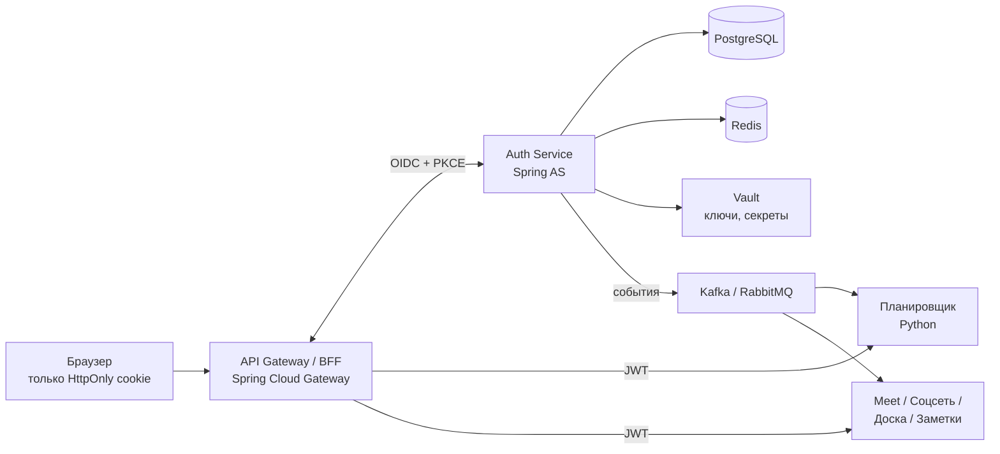
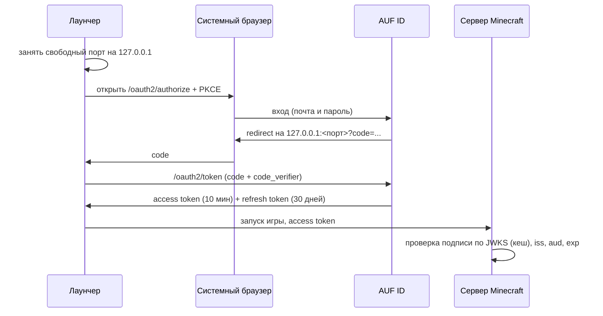
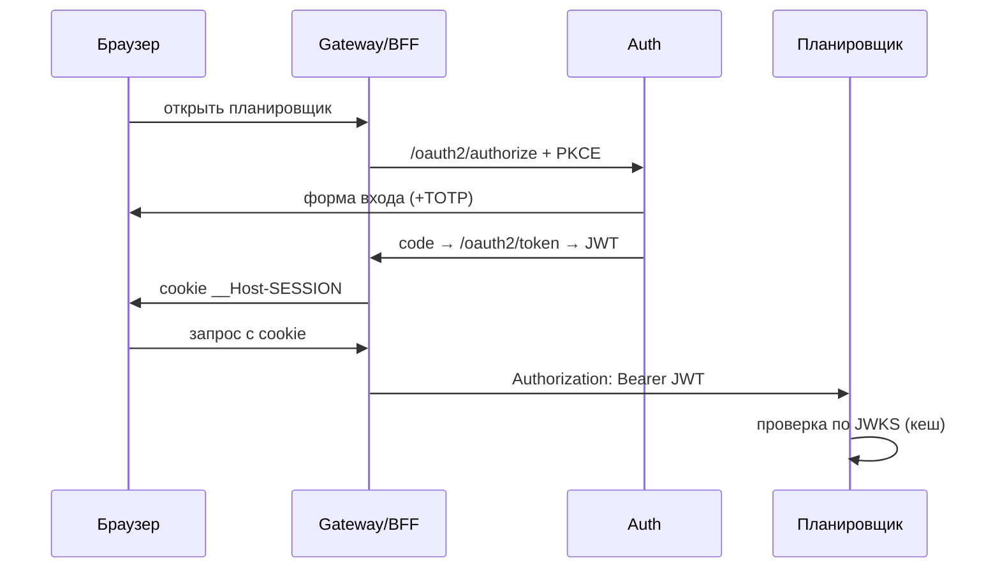

# Auth Service — архитектура SSO для экосистемы колледжа

Sep 24, 2026 · @EnotikF · последнее обновление 2026-10-07

## ★ Журнал решений

Документ писался 24 сентября. Часть решений с тех пор изменилась — здесь они собраны,
чтобы не пришлось сверять документ с кодом построчно. Ниже по тексту изменённые места
помечены как **(отменено)** или **(изменено)**.

| Дата | Решение | Почему |
| --- | --- | --- |
| 2026-09-29 | **Allowlist доменов отменён.** Регистрация открыта для любой почты. | Сервисом пользуются не только студенты колледжа. |
| 2026-09-29 | Саморегистрация с подтверждением почты вместо приглашений. | Быстрее к рабочему MVP. |
| 2026-09-29 | **Капча ALTCHA вместо блокировки аккаунта** после 3 неудач. | Блокировка позволяла держать чужой аккаунт закрытым. |
| 2026-09-30 | Ревью безопасности задачи 3: 5 находок. | См. шаги 10–15 в «Порядке работ». |
| **2026-10-07** | **Почта удаляется полностью, саморегистрация отменяется.** Учётки заводит админ, активация — по одноразовой ссылке, которую админ передаёт лично. | У студентов нет прямого доступа к доменным ящикам, значит подтвердить владение письмом нечем. Личные почты для рассылок — фаза 2. |
| **2026-10-07** | Переименование сервиса в **AUF ID** (`ru.auf.id`, репозиторий `auf-id`). | Имя `planner` не отражает содержимое: планировщика здесь нет. |
| **2026-10-07** | Лимит на `/oauth2/token` — **600/мин**. | Режет DoS в цикле, сотни входов из-за NAT проходят с запасом. |
| **2026-10-07** | Отдельный сервис-мост к Keycloak (`authservice`) закрыт, SSO делается здесь. | Своё решение уже написано и покрыто тестами — Keycloak не нужен, а его замена потом стоила бы миграции всех пользователей. |
| **2026-10-07** | Подтверждена граница: группы, кураторство и учебные данные **не живут в Auth**. | Было записано ещё в разделе 4 этого документа; подтверждено после попытки нарушить. |
| **2026-10-08** | **Первые клиенты — лаунчер Minecraft и планировщик, оба делаются одновременно.** | Решение пользователя. Раньше планировщик считался первым, потом лаунчер — верно «оба сразу». Важно: это два разных вида клиента, и требования у них расходятся (см. раздел 6). |
| **2026-10-08** | Лаунчер входит через **системный браузер** с возвратом на `http://127.0.0.1:<порт>`. | RFC 8252 для настольных приложений: лаунчер не видит пароль, а встроенный WebView видел бы (§8.12). Проверено: Spring AS разрешает любой порт для loopback, правок не нужно. |
| **2026-10-08** | **Refresh-токен: скользящее окно 30 дней** от последнего обновления, без общего предела. | Лаунчер запускают часто; «всегда вошёл», пока играешь, и брошенный токен сам умирает. Жёсткие 30/90 дней дёргали бы всех разом. |
| **2026-10-08** | Шаг 12 закрыт: коды и токены в БД — хеши SHA-256. **ПДн этим не закрыты.** | Claims токена Spring хранит рядом со значением, в `*_metadata`, обычным JSON — вместе с `name` и `email` (проверено зондом). Нужно отдельное решение, см. открытые вопросы. |
| **2026-10-08** | `PUBLIC` разделён на **`NATIVE`** (лаунчер) и **`BROWSER`** (SPA). | Refresh-токен на 30 дней настольному приложению отдать можно — у него есть хранилище секретов ОС; вкладке нельзя — украдёт XSS. Оба проходили как один вид. |
| **2026-10-08** | **Лаунчер делается позже — после того как авторизацию доведут и задеплоят.** | Решение пользователя. Критическим путём становится деплой (шаги 20, 21, 23, 19), а не фичи для клиентов. Refresh-токены не зря сделаны: понадобятся, когда до лаунчера дойдёт. |
| **2026-10-08** | При краже refresh-токена отзываются авторизации **только этого клиента**. | Утёк токен одного приложения, а не пароль. Украли токен лаунчера — вылетает лаунчер, в планировщике человек остаётся. |
| **2026-10-08** | **`NATIVE` выдаётся секрет клиента**, хотя спрятать его в программе нельзя. | Иначе Spring не даёт обменять refresh-токен: публичного клиента он опознаёт только по запросу с PKCE, а в запросе на обновление PKCE нет. Альтернативой был свой `AuthenticationConverter` в пути аутентификации — а свой код в аутентификации опаснее фиктивного секрета. Защищает здесь PKCE; так же устроен поток Google для desktop-приложений. |

## ★ План реализации по фазам

MVP — это минимум, с которым на реальных студентах могут запуститься **лаунчер Minecraft и планировщик** — они делаются одновременно (решение 2026-10-08). Задачи идут в порядке реализации: одна задача = одна сессия в Claude Code = один PR с тестами.

### Как вайбкодить это в Claude Code

- Положи этот документ в репозиторий как `docs/auth-architecture.md` и сошлись на него из `CLAUDE.md`, чтобы Claude Code всегда видел контекст.
- Одна задача за сессию. Начинай с «сначала напиши тесты, потом код».
- Никакой самописной криптографии и своих токенов: только Spring Security / Spring Authorization Server. Если Claude Code предлагает «свой JWT-фильтр» — это красный флаг.
- Секреты только через env / `.env` в `.gitignore`, никогда в коде.
- После каждой задачи из блоков «вход», «токены», «пароли» — отдельное код-ревью на безопасность.

### Фаза 1 — MVP

Нумерация задач сохранена: на неё ссылаются `CLAUDE.md` и история PR. Фактический стек
оказался новее заявленного: **Java 25, Spring Boot 4.1, Maven, Liquibase** (не Gradle и не Flyway).

- [x] **0. Каркас.** Java 25, Spring Boot 4.1, Maven, Docker Compose (PostgreSQL 18, Redis 8), Liquibase, Testcontainers. *(GitHub Actions — всё ещё не сделаны)*
- [x] **1. Схема БД.** Таблицы добавляются по мере надобности, а не все разом. Готово: `users`, `password_credentials`, `one_time_tokens` + таблицы Spring AS.
- [ ] ~~**2. Ограничение по домену.**~~ **(отменено 2026-09-29)** Allowlist доменов не делаем. Таблица `allowed_email_domains` из схемы выпадает.
- [x] **3. Authorization Server.** PKCE обязателен, подпись **ES256**, ключ из env, клиенты и авторизации в БД, claims `name` / `email` / `email_verified`, `/userinfo`.
  - [ ] **3.5 Ревью безопасности** (проведено 2026-09-30) — шаги 10–15 в «Порядке работ».
  - [ ] **3.6 Роли в токене** — claim `roles`, шаг 2.
- [x] **4. Вход.** Форма логина, Argon2id + pepper, rate limit (Bucket4j + Redis) по IP, одинаковые ответы на ошибки, **капча ALTCHA** после 3 неудач вместо блокировки аккаунта.
- [ ] **5. Выдача учёток админом.** **(изменено 2026-10-07)** Было: приглашения на почту. Стало: админ создаёт учётку → статус `INVITED` → одноразовая ссылка активации, которую админ передаёт лично → студент задаёт пароль и даёт согласие на ПДн → `ACTIVE`. Плюс массовый импорт из CSV.
- [ ] ~~**6. Сброс пароля.**~~ **(изменено 2026-10-07)** Самообслуживания без почты нет: админ выдаёт новую ссылку активации. Покрывается задачей 9.
- [ ] **7. Refresh-токены.** Ротация + reuse detection. **Нужны лаунчеру Minecraft:** без них нативное приложение требует повторный вход каждые 10 минут.
- [ ] **8. TOTP.** Обязателен для `ADMIN` и `CURATOR`, опционален для студентов, плюс recovery-коды. *(на продакшн не блокирует)*
- [ ] **9. Admin API.** Создание учёток, блокировка, выдача и снятие ролей, регистрация клиентов, выдача ссылок активации.
- [ ] **10. /me.** Профиль, смена пароля, список сессий. Плюс `/api/me/services` — в какие сервисы колледжа заходил аккаунт (для сервиса профиля).
- [ ] **11. Audit log.** Все события безопасности, только дозапись.
- [ ] **12. Gateway / BFF.** *(фаза 2 — сервисы пока проверяют JWT сами)*
- [ ] **13. Контракт для клиентов.** Описание claims и примеры проверки JWT. Нужны **Java, Python, TypeScript и Node.js** — экосистема разноязыкая.
- [ ] **14. Тесты безопасности.** Просроченный и чужой `aud`, подбор пароля, повтор refresh-токена, CSRF, повторный обмен использованного кода.

**Готово, когда:** студент по ссылке от админа входит в сервис колледжа, сервис сам проверяет JWT, админ может заблокировать пользователя, и через ≤ 10 минут доступ пропадает.

### ★ Порядок работ до продакшна

Шаг = одна ветка = один PR. Оценка в шагах, а не в часах: часть на час, часть на вечер.

**Веха 1 — другие команды могут разрабатывать** (9 шагов)

| Шаг | Что | Задача |
| --- | --- | --- |
| 1 | ✅ Миграция `user_roles` | 1 |
| 2 | ✅ Claim `roles` в токене + первый админ из конфигурации | 3.6 |
| 3 | ✅ Выдача учётки админом: `INVITED` + одноразовая ссылка | 5 |
| 4 | ✅ Страница активации: установка пароля → `ACTIVE` | 5 |
| 5 | ✅ Admin API: создать, забанить, выдать роль | 9 |
| 6 | ✅ Admin API: регистрация клиентов | 9 |
| 7 | ✅ Удалить отправку писем и саморегистрацию | — |
| 8 | ✅ Переименование в **AUF ID** | — |
| 9 | ✅ **CORS** — без него браузерное приложение не завершит вход | — |

**Веха 2 — можно пускать студентов** (15 шагов)

Порядок внутри вехи пересобирался дважды. Сначала 2026-10-08 под лаунчер: без шага 16
он отправлял бы человека в браузер каждые 10 минут. Затем в тот же день — **под деплой**:
пользователь решил делать лаунчер позже, после того как авторизацию доведут и задеплоят,
поэтому критическим путём стал сам деплой (шаги 20, 21, 23, 19), а не фичи для клиентов.
Прямо сейчас Auth нужен только планировщику, и всё, что ему требуется, готово.

| Шаг | Что | Задача |
| --- | --- | --- |
| 10 | ✅ Лимит 600/мин на `/oauth2/token` | 3.5 |
| 11 | ✅ Очистка истёкших авторизаций по расписанию | 3.5 |
| 12 | ✅ Хеширование кодов и токенов в БД | 3.5 |
| 13 | ✅ Отзыв авторизаций при блокировке пользователя | 3.5 |
| 14 | ✅ `ES256` в метаданных discovery вместо `RS256` | 3.5 |
| 22 | ✅ GitHub Actions: сборка и тесты | 0 |
| 16 | ✅ Refresh-токены: ротация, окно 30 дней, `NATIVE` с секретом | 7 |
| 25 | ✅ Выявление кражи refresh-токена — обрыв цепочки у этого клиента | 7 |
| 24 | ✅ ПДн (`name`, `email`) убраны из `*_metadata`, `/userinfo` — из таблицы `users` | 3.5 |
| 15 | Пересмотр лимитов по IP под NAT колледжа | 3.5 |
| 18 | Audit log | 11 |
| 19 | Spring Session + Redis — иначе только одна копия приложения | — |
| 20 | Доверие `X-Forwarded-For` только своему прокси | — |
| 21 | HTTPS и домен, `SESSION_COOKIE_SECURE=true`, выключить Swagger и dev-клиента | — |
| 23 | Бэкапы БД и **проверенное** восстановление | — |
| 17 | Массовый импорт учёток из CSV | 5 |

Шаг 17 (CSV) съехал в конец: он про удобство администратора, а не про то,
может ли студент войти. Шаги 24 и 25 — новые: 24 из ревью шага 12, 25 выяснился
при самом шаге 16.

**Шаг 25 — выявление кражи refresh-токена (сделано 2026-10-08).** Ротация включена: каждый обмен
выдаёт новый refresh-токен, а прежнее значение в строке затирается. Поэтому
повторно предъявленный токен **отвергается** (`invalid_grant`) — но не
**распознаётся**. Разница существенная: если токен украли и вор обменял его
первым, настоящий лаунчер получит отказ и молча выкинет человека, а токен вора
продолжит работать. Правильное поведение — при повторном предъявлении отозвать
всю цепочку, тогда доступ потеряют оба и человек войдёт заново.

Spring этого не делает: затёртое значение он нигде не помнит. Решено своим реестром
погашенных токенов — `authserver/RefreshTokenReuseDetector`, хеши в Redis с TTL,
равным сроку refresh-токена. Запись ведёт `HashedTokenAuthorizationService.save`:
это единственное место, где прежнее значение ещё видно в момент затирания. Отзыв —
`UserAuthorizationRevoker.revokeAllForClient`, **только у этого клиента** (решение
2026-10-08): утёк токен одного приложения, а не пароль.

Проверка срабатывает только в потоке обновления. Отзыв и introspection намеренно
не включены: честный клиент вправе попросить отозвать уже недействующий токен, и
выбрасывать за это человека из приложения неверно.

**Шаг 24 — ПДн в метаданных токена.** После шага 12 значения кодов и токенов
в БД захешированы, но claims Spring хранит рядом, в колонках
`access_token_metadata` и `oidc_id_token_metadata`, обычным JSON — вместе с
`name` и `email`. Просто выбросить их нельзя: из них Spring строит ответ
`/userinfo`. Два пути:

1. Отдавать `/userinfo` из таблицы `users` (свой `OidcUserInfoAuthenticationProvider`),
   а claims в метаданных не хранить. Побочный плюс: `/userinfo` начнёт показывать
   данные на текущий момент, а не на момент входа. Минус — свой код там, где
   сейчас работает стандартный.
2. Шифровать колонки. В документе шифрование персональных полей — фаза 2,
   нужен Vault.

Срочность выросла из-за шага 16: со скользящим окном 30 дней строка
`oauth2_authorization` живёт месяц, а не минуты, и очистка истёкших её не уберёт.

Вне обеих вех: TOTP (8), Gateway (12), личные почты для рассылок, ротация ключа подписи.

### Фаза 2 — укрепление

- [ ] Passkeys / WebAuthn как основной вход.
- [ ] Экран «Мои устройства» с отзывом сессий.
- [ ] Брокер событий (Kafka или RabbitMQ): `user.blocked`, `role.changed` и др. → мгновенный разлогин во всех сервисах.
- [ ] Vault: ключи подписи, pepper, секреты клиентов; плановая ротация ключей подписи.
- [ ] Шифрование персональных полей (envelope encryption) + blind index для email.
- [ ] DPoP и PAR.
- [ ] Introspection для чувствительных операций (админка, удаление данных).
- [ ] Наблюдаемость: Prometheus + Grafana, структурированные логи без персональных данных.

### Фаза 3 — под новые сервисы (meet, соцсеть, доска, заметки)

- [ ] Шаблон подключения нового сервиса: регистрация клиента, scopes, `aud`, подписка на события.
- [ ] Детальные права через ReBAC (OpenFGA): доски, заметки, методички, комнаты meet.
- [ ] Step-up аутентификация для опасных действий.
- [ ] mTLS между сервисами (service mesh), Kubernetes + HPA.
- [ ] Реплики PostgreSQL на чтение, Redis Cluster.
- [ ] Аудит по OWASP ASVS уровень 2 перед выходом на весь колледж.

## 1. Требования и допущения

Auth Service (**AUF ID**) — единый OpenID-провайдер колледжа: один аккаунт на планировщик, meet, соцсеть, доску, заметки, а также сервер и лаунчер Minecraft.

**Функциональные требования**

- SSO: один вход — доступ ко всем сервисам экосистемы.
- Вход по email и паролю. Внешних провайдеров (VK ID, Яндекс ID и т.п.) нет. **(изменено)** Allowlist доменов отменён — проверка домена ничего не даёт, потому что аккаунт всё равно создаёт админ.
- **(изменено 2026-10-07)** Аккаунт появляется **только** через админа: он создаёт учётку и передаёт студенту одноразовую ссылку активации. Писем сервис не отправляет вообще — у студентов нет прямого доступа к доменным ящикам, поэтому подтвердить владение письмом нечем.
- MFA (TOTP, позже passkeys), роли, управление сессиями, админка, доступ сервисов друг к другу.

**Нефункциональные требования**

| Параметр | Цель |
| --- | --- |
| Пользователи | 1–10 тыс., архитектура без переделки до 100 тыс.+ |
| Пик нагрузки | утро перед парами, сотни входов в минуту |
| Задержка `/oauth2/token` | p95 < 300 мс (основное время — Argon2id) |
| Доступность | 99,5% в учебное время; уже выданные токены работают, даже если Auth лежит |
| Безопасность | ориентир OWASP ASVS уровень 2, 152-ФЗ |

По трафику это не хайлоад. Масштабируемость закладывается архитектурой: сервис stateless, сервисы проверяют JWT локально и не ходят в Auth на каждый запрос.

**Ограничения:** команда студентов; Auth пишется на Java, планировщик параллельно на Python, поэтому протокол должен быть языконезависимым стандартом.

## 2. Общая схема

Стандарт — OAuth 2.1 + OpenID Connect на Spring Authorization Server; браузер видит только cookie, сервисы проверяют JWT сами.



Сервисы берут публичные ключи из `/oauth2/jwks` и проверяют токены без обращения к Auth; события сообщают им о блокировках и смене ролей.

**Ключевые решения**

| Решение | Почему | Цена |
| --- | --- | --- |
| OAuth 2.1 + OIDC на Spring Authorization Server | Стандарт, готовые клиенты для Python (Authlib), свою криптографию не пишем | Высокий порог входа в Spring AS |
| Authorization Code + PKCE для всех пользовательских клиентов | Единственный рекомендуемый flow в OAuth 2.1 | Нужен редирект на страницу логина |
| BFF: токены на сервере, в браузере только cookie | XSS не может украсть токен | Лишний компонент (Gateway) |
| Client Credentials для сервис-сервис | У каждого сервиса своя учётка и scopes | Управление секретами |
| Access JWT 10 мин + непрозрачный refresh с ротацией | Проверка без запроса к Auth + быстрый отзыв | До 10 мин доступа после блокировки (решается событиями) |
| Свой Auth вместо Keycloak | Учебный и портфолио-проект, полный контроль | Больше кода и ответственности; Keycloak можно использовать как временную заглушку |

## 3. Методы защиты

Защита строится слоями: строгий вход, короткие токены, зашифрованные данные и права, которые каждый сервис проверяет сам.

### Аутентификация

- Нормализация email (lowercase, trim, без `+alias`). **(отменено)** Allowlist доменов и подтверждение ящика письмом: писем нет.
- Регистрации нет вообще — только выдача учёток админом. Открытой формы нет, значит нет и фейковых аккаунтов.
- Одноразовая ссылка активации живёт 7 дней, хранится только как SHA-256, используется один раз.
- Пароли: **Argon2id** (`Argon2PasswordEncoder`) + pepper, который хранится вне БД. Правила по NIST 800-63B: от 12 символов, без требований к составу, проверка по списку утёкших паролей.
- MFA: **TOTP** + recovery-коды в MVP; **passkeys / WebAuthn** в фазе 2. Обязательна для `ADMIN` и `CURATOR`.

### Защита от атак

- Rate limiting (Bucket4j + Redis) по IP и по аккаунту, прогрессивная задержка, капча после N неудач.
- Нет перебора пользователей: одинаковый текст и время ответа для «нет такого email» и «неверный пароль», в том числе на сбросе пароля.
- Cookie `__Host-` с `Secure; HttpOnly; SameSite=Lax`, CSRF-токены, строгий CSP и `frame-ancestors 'none'` на страницах логина.
- Refresh-токены с ротацией и reuse detection.
- Фаза 2: **DPoP** — токен привязан к ключу клиента, украденный токен бесполезен.

### Токены и ключи

- Подпись **ES256**, публичные ключи в `/oauth2/jwks` с `kid`, плановая ротация (старый ключ ещё висит в JWKS до истечения токенов).
- Приватные ключи — в env (MVP), затем в **Vault**. Никогда в git или открыто в БД.
- Каждый сервис проверяет подпись, `iss`, `exp` и **свой** `aud`: токен планировщика не принимается соцсетью.

### Данные

- TLS 1.3 на всех соединениях, mTLS между сервисами в фазе 3.
- Шифрование персональных полей (envelope encryption через Vault Transit), поиск по email через blind index (HMAC).
- Минимизация: в Auth только данные для входа и ФИО. Аватары, «о себе» и пр. живут в соцсети.
- **152-ФЗ:** согласие на обработку ПДн с версией документа, хранение в РФ, журнал доступа. Среди студентов будут несовершеннолетние — юридические детали нужно согласовать с администрацией колледжа.
- Audit log только на дозапись; в обычных логах нет паролей, токенов и полных email.

### Авторизация

- Auth выдаёт **личность + крупные роли + scopes** (`planner.read`, `notes.write`).
- Детальные права (кто редактирует эту доску или методичку) — в самих сервисах, в фазе 3 — через OpenFGA. В JWT их не кладём: токен раздувается и устаревает.

## 4. Сущности (PostgreSQL)

Ключи — UUIDv7; все секреты и токены хранятся только в виде хешей или зашифрованными.

| Таблица | Ключевые поля | Фаза |
| --- | --- | --- |
| `users` | id, email (зашифр.), email\_hash, full\_name, email\_verified, status (`INVITED/ACTIVE/LOCKED/BLOCKED/DELETED`), created\_at, last\_login\_at | 1 |
| `password_credentials` | user\_id, hash (Argon2id), changed\_at, must\_change | 1 |
| `totp_credentials` | user\_id, secret (зашифр.), confirmed\_at | 1 |
| `recovery_codes` | user\_id, code\_hash, used\_at | 1 |
| `webauthn_credentials` | user\_id, credential\_id, public\_key, sign\_count, transports, name, last\_used\_at | 2 |
| `user_roles` | user\_id, role (`ADMIN / CURATOR / STUDENT`), granted\_at — **(изменено)** вместо трёх таблиц одна: роли грубые, их три, справочник и права-строки избыточны | 1 |
| `permissions`, `role_permissions` | детальные права | 3 (ReBAC) |
| `oauth2_registered_client` | сервисы-клиенты: redirect\_uri, scopes, auth method (схема Spring AS) | 1 |
| `oauth2_authorization` | выданные токены и семьи refresh (схема Spring AS) | 1 |
| `oauth2_authorization_consent` | согласия на scopes (схема Spring AS) | 1 |
| `user_sessions` | user\_id, device/UA, IP, created\_at, last\_seen, revoked\_at (горячие данные — Redis) | 1 |
| `invitations` | email, preset role, invited\_by, expires\_at, accepted\_at | 1 |
| `one_time_tokens` | token\_hash, purpose (`INVITE / PASSWORD_RESET`), user\_id, expires\_at, used\_at — **готова**; `EMAIL_VERIFY` отменён | 1 |
| `consents` | user\_id, doc\_type, doc\_version, accepted\_at, ip | 1 |
| `audit_events` | actor\_id, action, target, ip, result, metadata (jsonb), created\_at — только дозапись | 1 |
| `service_access` | user\_id, client\_id, first\_seen\_at, last\_seen\_at — в какие сервисы колледжа заходил аккаунт | 1 |
| `signing_keys` | kid, alg, status (`ACTIVE / RETIRING / REVOKED`), ссылка на ключ в Vault | 2 |

Попытки входа — счётчики в Redis.

> **Граница сервиса.** Учебные группы, закрепление кураторов, расписание и статистика — домен
> профильного сервиса, а не Auth: здесь только роль `CURATOR`. Критерий: может ли доменный сервис
> вычислить это сам? Состав группы — может, значит его данные. «В какие сервисы заходил аккаунт» —
> не может, это видно только провайдеру, поэтому таблица `service_access` живёт здесь.

## 5. Ручки API

Стандартные OIDC-эндпоинты даёт Spring AS; самим писать нужно вход, приглашения, `/me`, админку и internal API.

**Стандарт OIDC (из коробки)**

```
GET  /.well-known/openid-configuration
GET  /oauth2/jwks
GET  /oauth2/authorize
POST /oauth2/token
POST /oauth2/revoke
POST /oauth2/introspect        # для чувствительных операций
GET  /userinfo
GET  /connect/logout           # выход из всех сервисов
POST /oauth2/par               # фаза 2
```

**Вход, приглашения, восстановление**

```
GET/POST /login                           # email + пароль, капча после 3 неудач
POST /login/mfa/totp
POST /login/webauthn/options              # фаза 2
POST /login/webauthn                      # фаза 2
GET  /api/v1/activations/{token}          # проверить ссылку активации
POST /api/v1/activations/{token}/accept   # пароль + согласие на ПДн
# (отменено) /email/verify, /password/forgot, /password/reset — писем нет,
# новую ссылку выдаёт админ через /admin/users/{id}/activation-link
```

**Личный кабинет `/api/v1/me`**

```
GET    /me                 PATCH /me
POST   /me/password
GET    /me/mfa
POST   /me/mfa/totp/setup   POST /me/mfa/totp/confirm   DELETE /me/mfa/totp
POST   /me/passkeys/options POST /me/passkeys  GET /me/passkeys  DELETE /me/passkeys/{id}   # фаза 2
POST   /me/recovery-codes
GET    /me/sessions   DELETE /me/sessions/{id}   DELETE /me/sessions   # выйти везде
GET    /me/security-events
```

**Админка `/api/v1/admin`** — только `ADMIN` + MFA

```
GET/POST   /admin/users          GET/PATCH /admin/users/{id}
POST       /admin/users/import                 # CSV группы → приглашения
POST       /admin/invitations    DELETE /admin/invitations/{id}
PATCH      /admin/users/{id}/status            # блокировка
POST       /admin/users/{id}/roles   DELETE /admin/users/{id}/roles/{roleId}
POST       /admin/users/{id}/sessions/revoke
POST       /admin/users/{id}/mfa/reset
POST       /admin/users/{id}/activation-link   # выдать новую ссылку активации
GET        /admin/audit
CRUD       /admin/clients        POST /admin/clients/{id}/secret/rotate
POST       /admin/keys/rotate                  # фаза 2
```

**Между сервисами** (client\_credentials, scope `users.read`)

```
GET  /internal/v1/users/{id}
POST /internal/v1/users:batch      # ФИО по списку id
```

**События (фаза 2):** `user.created`, `user.updated`, `user.blocked`, `user.deleted`, `role.granted`, `role.revoked`, `session.revoked`.

## 6. Интеграция клиентов

> Этот раздел — **почему** так устроено. Практическая инструкция для разработчика
> подключаемого сервиса лежит отдельно: [service-integration.md](service-integration.md).
> Ей можно давать ссылку, не объясняя каждому заново.

Клиентов сразу два, и делаются они одновременно (решение 2026-10-08). Это не одна и та
же задача дважды: лаунчер — настольное приложение, планировщик живёт в браузере, и
требования к ним расходятся в трёх местах.

| | Лаунчер | Планировщик |
| --- | --- | --- |
| Вид клиента | `NATIVE` | `BROWSER` |
| Где идёт вход | системный браузер, возврат на `127.0.0.1` | та же вкладка, возврат на свой домен |
| Продление входа | **refresh-токен**, 30 дней | молчаливый заход на `/oauth2/authorize` — его узнаёт сессия провайдера |
| Что нужно от Auth | шаг 16 (готов) | CORS (шаг 9, готов) + `prompt=none` (исправлено 2026-10-08) |

Хорошая новость: **ничего дополнительного в Auth им не нужно.** Оба подключаются
регистрацией клиента через админку — в этом и смысл задачи 9.

### 6.1 Лаунчер Minecraft

Настольное приложение. По RFC 8252 («OAuth 2.0 для нативных приложений») вход идёт
в **системном браузере**, а не во встроенном окне: встроенное окно принадлежит
лаунчеру, то есть лаунчер технически может прочитать и пароль, и cookie сессии
(§8.12 прямо против этого). Код возвращается на локальный порт, который лаунчер
занимает на время входа.



Что для этого уже готово и чего нет:

| | Состояние |
| --- | --- |
| Клиент вида `PUBLIC` с PKCE | ✅ заводится через `POST /api/v1/admin/clients` |
| Возврат на `http://127.0.0.1:<любой порт>` | ✅ без правок: Spring AS разрешает любой порт для loopback (RFC 8252 §7.3), наша проверка адреса — только «абсолютный, без фрагмента» |
| Access token с `sub`, `name`, `email`, `roles` | ✅ |
| **Refresh-токен** | ✅ шаг 16: 30 дней скользящим окном, с ротацией; в БД хешем. Выдаётся только виду `NATIVE` |
| Выявление кражи refresh-токена | ✅ шаг 25: повторно предъявленный токен обрывает цепочку у этого клиента |
| Отзыв доступа при блокировке студента | ⚠️ авторизации удаляются (шаг 13), но выданный access token доживает до 10 минут |

**Почему шаг 16 блокирующий.** Access token живёт 10 минут — это осознанно: сервисы
проверяют подпись сами и в Auth не ходят. Без refresh-токена лаунчер через 10 минут
обязан снова вести человека в браузер. Для сайта это незаметно (там есть сессия у
провайдера), для лаунчера — нет: игру запускают на часы.

**Как лаунчер хранит refresh-токен.** Это секрет, равный доступу к учётке на 30 дней.
Файл в папке лаунчера — худший вариант. Правильно: системное хранилище секретов
(Windows Credential Manager, Keychain, Secret Service/`libsecret`). Это ответственность
лаунчера, но в контракт на подключение записать надо.

**Границы.** Сервер Minecraft и права на нём (белый список, донат, бан) — не в AUF ID.
Из токена сервер берёт `sub` и `roles`; всё остальное — его собственные данные,
как и у любого другого сервиса экосистемы (раздел 4).

### 6.2 Python-планировщик

Делается одновременно с лаунчером (решение 2026-10-08). Планировщик — **чисто браузерное
приложение**, python-часть за ним — микросервис (решение 2026-10-08).

**Клиент здесь — браузерное приложение, а не микросервис.** Клиентом называется тот, кто
ведёт человека на страницу входа; микросервис за ним только проверяет уже готовый токен,
то есть он **сервер ресурсов**. Регистрировать микросервис в AUF ID не нужно вовсе, и
секрета у него нет — достаточно прочитать `jwks_uri` из discovery и сверять подпись,
`iss`, `aud` и `exp`.

Вид клиента у браузерного приложения — `BROWSER`: без секрета (в JavaScript его спрятать
негде) и **без refresh-токена** (его украл бы XSS).

#### Как планировщик продлевает вход

Вместо refresh-токена — «молчаливое продление»: вкладка заходит на `/oauth2/authorize` с
параметром `prompt=none`. Сессию у AUF ID провайдер узнаёт по cookie и сразу возвращает
новый код, не показывая форму. Не вошёл — возвращается ошибка `login_required`, и по ней
приложение отправляет человека входить по-настоящему.

Два ограничения, которые нужно знать заранее:

1. **Только переходом страницы или всплывающим окном, не скрытым iframe.** `/oauth2/authorize`
   отвечает `X-Frame-Options: DENY` (умолчание Spring Security, защита от clickjacking —
   менять его не планируем). Приём «невидимый iframe для silent renew», который советуют в
   статьях про SPA, здесь не заработает. Закреплено тестом
   `authorizeEndpointForbidsBeingEmbeddedInAnIframe`.
2. **Нужен CORS.** Обмен кода на токен вкладка делает из JavaScript, поэтому адрес
   планировщика должен быть в `AUTH_CORS_ALLOWED_ORIGINS` — иначе браузер не отдаст ответ
   приложению. Пусто по умолчанию, `*` запрещён.

> **Исправлено 2026-10-08.** Раньше `prompt=none` без входа отдавал редирект на `/login`:
> правило `anyRequest().authenticated()` отсекало запрос до того, как до него доходил Spring.
> Приложение получало HTML-страницу вместо ошибки, и молчаливое продление сломалось бы у
> любой стандартной OIDC-библиотеки на первом же обновлении токена.

Остальной контракт — как был.

Планировщик не хранит пароли и не делает логин — он только проверяет JWT. Контракт фиксируем сейчас, чтобы Java и Python шли параллельно.



1. Регистрируем планировщик как клиента (`aud=planner`, scopes `planner.*`).
2. На каждый запрос FastAPI/Django проверяет подпись по JWKS (Authlib/PyJWT, кеш ключей), `iss`, `aud`, `exp`.
3. Из токена берёт `sub` (id пользователя) и `roles`; группы и кураторство хранит у себя по `sub`.
4. ФИО по списку id — через `POST /internal/v1/users:batch`; с фазы 2 — подписка на `user.blocked` и `user.updated`.

**(изменено 2026-10-07)** Keycloak как временная заглушка больше не нужен: Auth уже выдаёт токены,
и команды могут разрабатывать против него напрямую. Отдельный сервис-мост к Keycloak закрыт — он
означал бы обязательную миграцию всех пользователей при переходе на своё решение.

Контракт одинаков для всех языков экосистемы — Java, Python, TypeScript, Node.js: прочитать
`jwks_uri` из discovery, проверить подпись, `iss`, `aud`, `exp`, взять `sub` и `roles`.

## 7. Что пересмотреть при росте и открытые вопросы

**При росте:** хранение сессий (Redis Cluster), реплики PostgreSQL на чтение, вынос профиля в отдельный сервис, выбор между Kafka и RabbitMQ под реальный поток событий.

**Открытые вопросы**

- [x] ~~Нужен ли отдельный вид клиента для настольных приложений?~~ Решено 2026-10-08: `PUBLIC` разделён на `NATIVE` и `BROWSER`.
- [ ] **Где лаунчер хранит refresh-токен?** Системное хранилище секретов ОС или файл. От этого зависит, насколько страшна кража токена и не нужно ли сократить окно с 30 дней.
- [x] ~~Как закрыть ПДн в `*_metadata`~~ Решено 2026-10-08: свой маппер `/userinfo` из таблицы `users`. Вырезать claims целиком нельзя — служебные читают `/connect/logout`, `/oauth2/introspect` и поток обновления токена.
- [ ] **Как админ передаёт студенту ссылку активации?** Показать в панели и продиктовать, выгрузить списком, распечатать. От этого зависит формат ответа Admin API.
- [ ] **Кто в колледже заводит учётки** — учебная часть, куратор или оба? Если куратор, ему нужна часть прав админа.
- [ ] **Как колледж выходит в интернет** (NAT или нет)? Если все студенты приходят с одного публичного IP, текущие лимиты `20/мин` на вход отрежут живых людей в час пик. Блокирует шаг 15.
- [ ] Какие домены почты считать «колледжными» (студенты и преподаватели на одном или разных) — нужно для проверки при создании учётки.
- [ ] Кто и как генерирует CSV со списками групп и что делать с выпускниками и отчисленными?
- [ ] Где хостится система (сервер колледжа или облако в РФ) — это влияет на 152-ФЗ и Vault.
- [x] ~~Можно ли отправлять письма на почту колледжа без спам-фильтров?~~ Снято 2026-10-07: писем нет.
